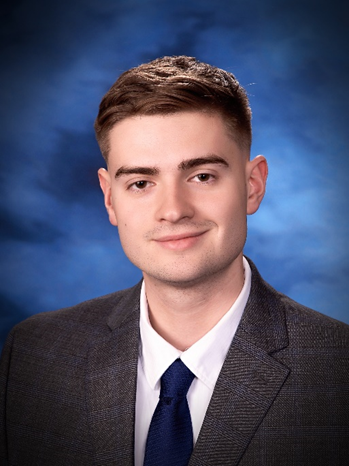

# CPS493-03 Charles Olinsky Spring 2024

1. I began coding my freshman year here at SUNY New Paltz. I was unsure at first if it was something I wanted to pursue but I met some really great people in my major and decided to stick with it. From there, I completed Computer Science I, II, and III, as well as Object Oriented Programming, Assembly Languages and Computer Architecture, Software Engineering, Operating Systems, and Cybersecurity. I’m sure there are a few I forgot but this is the end of my Computer Science major, and this will be the last semester I take here at New Paltz. As far as programs I’ve written, I have a few under my belt. Recently I developed a scheduling app to accommodate my on-campus job, I did this using React/Typescript. I also completed several other React projects such as a lifeguard scheduling system, and a gas turbine dashboard (which was a hackathon winner!). I’ve done some projects here at New Paltz, specifically for my Software Engineering course with Professor Denizard. I acted as team leader for that project and using HTML/CSS and PHP, my team and I received an A on our project. Additionally, I completed two internships at GE Vernova where I worked in Python with BERTopic, as well as with ExtJS to develop custom components for an app called Rally. I will be continuing as a full-time employee at GE Vernova this coming Summer.

2. I am really excited to take this course because I have never experimented with Vue before and if I am being honest, my vanilla HTML/CSS and JavaScript skills are subpar. I hope by taking this course I can develop a stronger foundation in the fundamental concepts of real-world software development so that I can use those skills in the workplace and to further my career.

3. I agree that these past few years have been challenging, but all that means for me is that I have succeeded and thrived under rigorous circumstances, and I am better equipped than ever to handle more and greater challenges. As long as you are clear and concise about your expectations of me, I will do everything in my power to meet them every time. I appreciate your asking!
